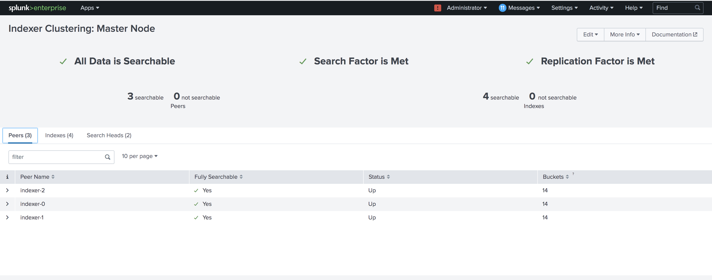

## Helm Chart for Splunk

This repo contains the helm chart for deploying a distributed version on Splunk on a kubernetes cluster. I'm specificially using the [3idx1sh1cm](https://github.com/splunk/docker-splunk/tree/develop/test_scenarios/kubernetes#3idx1sh1cm---recommended-for-most-users) configuration which has a dedicated Cluster Master, 3 clustered Indexers and a single Search Head. 

### Prerequisites

* [Helm](https://helm.sh/)
* [kubectl](https://kubernetes.io/docs/tasks/tools/install-kubectl/)
* [Minikube](https://kubernetes.io/docs/tasks/tools/install-minikube/) for local deployment OR a dedicated Kubernetes Cluster like [GKE](https://cloud.google.com/kubernetes-engine)

### Steps for deploying Splunk to Minikube

##### Setup minikube

`$ minikube start`

##### Set kubectl context to minikube

`$ kubectl config use-context minikube`

##### Create splunk namespace for deploying the chart

`$ kubectl create namespace splunk`

##### Install the chart on the minikube cluster

Clone this repository and navigate inside the directory

```
$ git clone https://github.com/anooprh/splunkchart.git
$ cd splunkchart
```

Install the helm chart

`$ helm install --generate-name --namespace=splunk .`

##### Check if all the pods are up and running

You should see 1 master pod, 1 search head pod and 3 indexer pods w.r.t Splunk. Additionally, a nginx pod and a helm chart pod are started as well.

```
$ kubectl -n splunk get pods
NAME                                      READY   STATUS    RESTARTS   AGE
chart-1589474584-splunk-6cc858b6b-2jn5l   1/1     Running   0          73s
indexer-0                                 1/1     Running   0          73s
indexer-1                                 1/1     Running   0          67s
indexer-2                                 1/1     Running   0          50s
master-c69b498b8-f79kq                    1/1     Running   0          73s
search-645fb76c45-bmh8c                   1/1     Running   0          73s
splunk-defaults-6b9b7b7b59-4jxwz          1/1     Running   0          73s
```

##### Setup port-forwarding for the master

`kubectl -n splunk port-forward svc/master 9999:8000`

##### Navigate to Splunk Home Dashboard on the master pod and check everything is setup correctly. 

Navigate to http://localhost:9999/ and login using the default username : `admin` and password : `helloworld`. These can be changed in the template yaml files. 

Check the distributed setup by navigating to Settings > Distributed Environment. 


On Indexer clustering, check if all the Indexers and Search Heads are healthy. 



To get the IP addresses of the indexers, navigate to the Distributed Search section. 

#### Setting up a universal forawrder to feed data to an indexer in minikube

##### Download the universal forwarder

Go to https://www.splunk.com/en_us/download/universal-forwarder.html and download the forwarder for your platform. Unzip the forwarder at `~/splunkforwarder`

##### Setup port forwarding for one of the indexers

`$ kubectl -n splunk3 port-forward indexer-1 9997:9997`

##### Generate some logs

I generate random sentences every 2 seconds and use it as a log file (at `/tmp/quotes.log`)

`while true; do curl -s http://metaphorpsum.com/paragraphs/1/3 && printf "\n" && sleep 2; done 2>&1 | tee  /tmp/quotes.log`

##### Configure forwarder inputs.conf

Create or edit the `SPLUNK_FORWARDER/etc/system/local/inputs.conf`

```
cd ~/splunkforwarder
vim etc/system/local/inputs.conf
```

and ensure it monitors for `quotes.log` by having the following in `inputs.conf`

```
[monitor:///tmp/quotes.log]
index = main
disabled = 0
```

##### Configure forwarder outputs.conf

Create or edit the `SPLUNK_FORWARDER/etc/system/local/outputs.conf`

```
cd ~/splunkforwarder
vim etc/system/local/outputs.conf
```

and ensure it forwards data to the port `9997` on `127.0.0.1`

```
[tcpout]
defaultGroup = indexers

[tcpout:indexers]
server = 127.0.0.1:9997

```

##### After few seconds, check the logs in splunk master

These logs end up in `main` index. 

Search for `index=main` and set time to `All Time` to see the quotes in splunk. 


